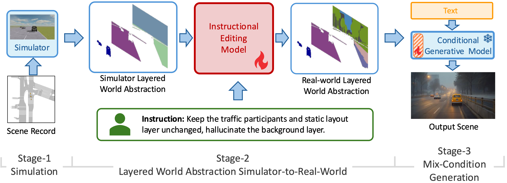
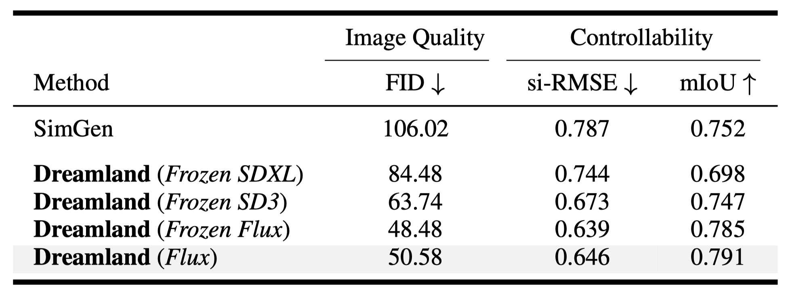

  <video loop autoplay muted playsinline src="../assets/img/vid2sim/simulation/sim_nav1.mp4"></video>

<!--research-section-splitter-->

## TL; DR

:selfie: **Dreamland** is a hybird generation pipeline that connects simulators and generative models to achieve controllable and configurable world creation.

:robot: **Dreamland** demonstrates superior quality and controllability in scene generation, and improves the adaptation of embodied agents to the real world.

## Dreamland-Video

  <figure style="display: flex; flex-direction: column; gap: 8px;">
    <video id="videoPlayer1" style="display:block; width:80%; height:auto;" muted autoplay loop controls playsinline>
      <source src="../assets/img/vid2sim/simulation/sim_nav1.mp4" type="video/mp4">
      Your browser does not support the video tag.
    </video>
    

      ●
      ●
      ●
    

    <figcaption style="text-align: center; font-size: 18px;">
        Simulator-Conditioned Generation
    </figcaption>
  </figure>

  <figure style="display: flex; flex-direction: column; gap: 8px;">
    <video id="videoPlayer2" style="display:block; width:80%; height:auto;" muted autoplay loop controls playsinline>
      <source src="../assets/img/vid2sim/realworld/realworld_nav1.mp4" type="video/mp4">
      Your browser does not support the video tag.
    </video>
    

      ●
      ●
      ●
    

    <figcaption style="text-align: center; font-size: 18px;">
        Diverse Scene Generation
    </figcaption>
  </figure>

  <figure style="display: flex; flex-direction: column; gap: 8px;">
    <video id="videoPlayer3" style="display:block; width:80%; height:auto;" muted autoplay loop controls playsinline>
      <source src="../assets/img/vid2sim/realworld/realworld_nav1.mp4" type="video/mp4">
      Your browser does not support the video tag.
    </video>
    

      ●
      ●
      ●
    

    <figcaption style="text-align: center; font-size: 18px;">
        Safety-Critical Scene
    </figcaption>
  </figure>

  
## Dreamland Architecture

    

Dreamland pipeline consists of three key stages: (1) *Stage-1 Simulation*: scene construction with physics-based simulator, (2) *Stage-2 LWA-Sim2Real*: transferring the Sim-LWA from simulation to Real-LWA with an instructional editing model and user instructions, and (3) *Stage-3 Mixed-Condition Generation*: rendering an aesthetic and realistic scene with a large-scale pretrained image or video generation model

## Experiments

    

Dreamland pipeline demonstrate superior quality and controllability, with scalability that benefits from stronger pre-trained model deployed for *Stage-3*.

## Dreamland Extension

    

Dreamland pipeline is generalized to various downstream tasks, including **scene editing**, **safety-critical scene generation**, and **zero-shot generation on urban simulator**.

<!-- <pre><code class="language-plain">@article{xie2024vid2sim,
  title={Vid2Sim: Realistic and Interactive Simulation from Video for Urban Navigation},
  author={Ziyang Xie and Zhizheng Liu and Zhenghao Peng and Wayne Wu and Bolei Zhou},
  journal={Preprint},
  year={2024}
}
</code></pre> -->

